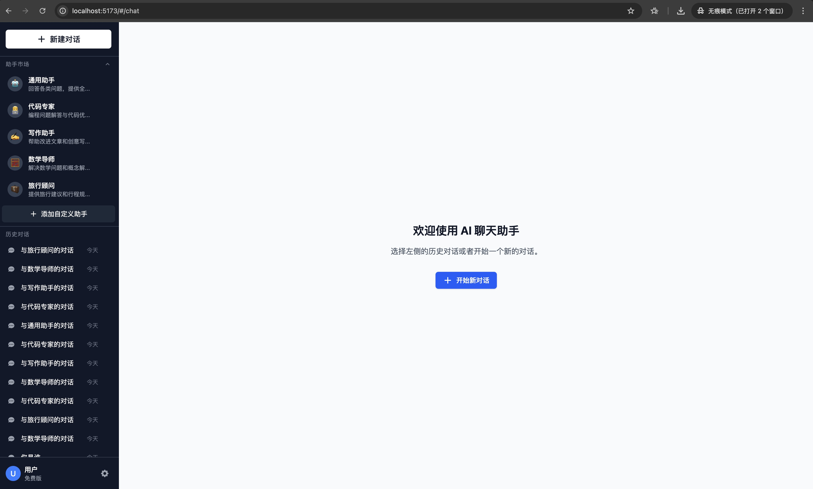
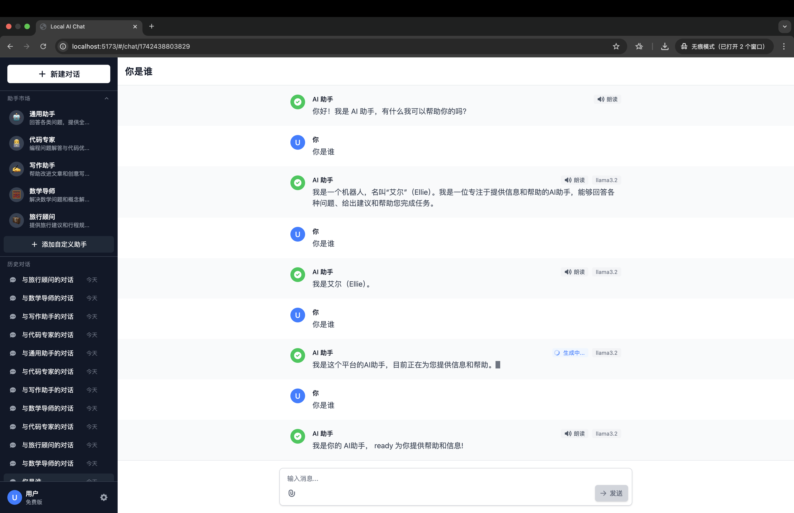
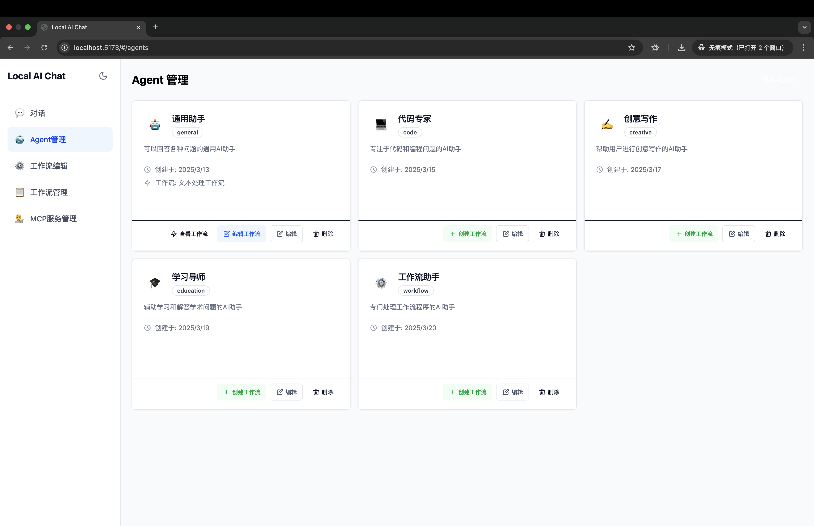
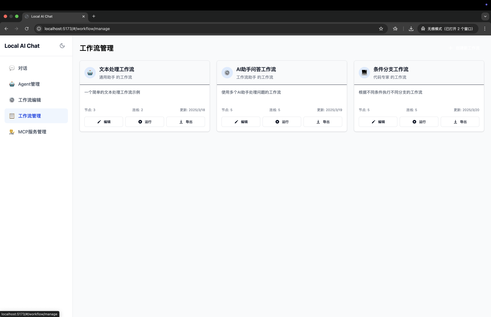
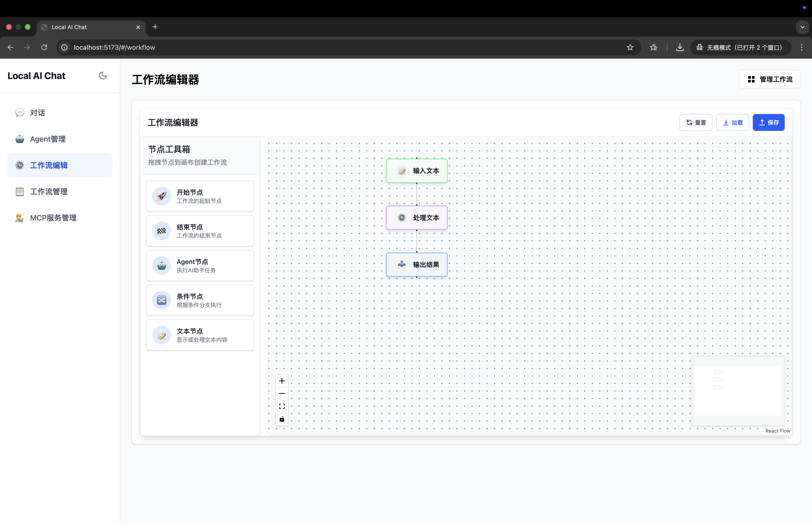

# Local AI Chat

> 完全基于cursor IDE PRO + claude-3.7-sonnet大模型开发，开启AI编程零代码模式～～

这是一个使用 [Vite](https://vitejs.dev/) + [React](https://react.dev/) + [TypeScript](https://www.typescriptlang.org/) 构建的项目，结合了 [Tailwind CSS](https://tailwindcss.com/) 和 [Radix UI](https://www.radix-ui.com/) 组件库。



## 功能特性

本项目是一个基于本地大语言模型的智能对话系统，提供以下核心功能：

### 智能聊天

- **多模型支持**：集成Ollama，支持多种本地大语言模型
- **流式响应**：实时流式显示AI回复，提供更自然的对话体验
- **会话管理**：创建、保存和管理多个聊天会话
- **文件上传**：支持上传文件与AI交互
- **聊天历史**：自动保存并组织聊天历史记录




### 智能代理（Agents）

- **自定义代理**：创建和配置具有特定角色和能力的AI代理
- **代理管理**：编辑、删除和组织多个智能代理
- **系统提示词**：为代理设置专属的系统提示词，定制AI行为和专业领域



### 工作流（Workflow）

- **可视化编辑器**：直观的工作流设计界面
- **任务自动化**：将复杂任务拆分为可自动化的工作流程
- **代理集成**：在工作流中集成和编排多个AI代理
- **自定义节点**：支持创建和配置自定义工作流节点




## 技术特性

- **本地部署**：完全在本地运行，保护数据隐私安全
- **低延迟**：本地模型处理，减少网络延迟
- **可扩展**：模块化设计，易于扩展新功能
- **轻量级**：优化的资源占用，适合个人电脑运行

## 前提条件

- 安装 [Ollama](https://ollama.ai/) 并运行本地模型
- 推荐安装以下模型:
  - Llama3.2:latest
  - deepseek-r1:8b
  - deepseek-r1:14b

## 使用场景

- 个人助理：日常问答、信息查询和任务辅助
- 内容创作：写作辅助、创意激发和内容改进
- 知识管理：整理笔记、归纳总结和知识提取
- 开发助手：代码生成、调试辅助和技术咨询
- 自动化流程：创建自定义工作流处理复杂任务

## 开始使用

首先，安装项目依赖：

```bash
npm install
```

然后，运行开发服务器：

```bash
npm run dev
```

在浏览器中打开 [http://localhost:5173](http://localhost:5173) 查看结果。


你可以通过修改 `src/App.tsx` 开始编辑页面。保存文件后，页面会自动更新。

## 项目结构

- `src/components` - 可复用的UI组件
- `src/pages` - 应用的页面组件
- `src/lib` - 工具函数和共享逻辑
- `src/store` - 状态管理
- `src/styles` - 全局样式和Tailwind配置
- `src/types` - TypeScript类型定义

## 构建生产版本

要构建生产版本，运行：

```bash
npm run build
```

预览生产构建：

```bash
npm run preview
```

## 学习更多

要了解更多关于Vite和React的信息，请查看以下资源：

- [Vite 官方文档](https://vitejs.dev/guide/) - 了解Vite的功能和API
- [React 文档](https://react.dev/) - 了解React
- [Tailwind CSS 文档](https://tailwindcss.com/docs) - 了解Tailwind CSS
- [Radix UI 文档](https://www.radix-ui.com/docs/primitives/overview/introduction) - 了解Radix UI组件

# 本地AI工作流引擎

基于Python实现的轻量级AI工作流解析和执行引擎，支持从React Flow导出工作流配置转换成可执行的工作流。

## 项目结构

```
backend/
├── main.py                     # 应用入口
├── requirements.txt            # 依赖项
└── workflow_engine/           # 工作流引擎包
    ├── __init__.py
    ├── api/                   # API路由
    │   ├── __init__.py
    │   ├── executor_routes.py # 执行器API
    │   └── workflow_routes.py # 工作流API
    ├── core/                  # 核心组件
    │   ├── __init__.py
    │   └── engine.py          # 工作流引擎
    ├── executors/             # 执行器
    │   ├── __init__.py
    │   ├── base_executor.py   # 执行器基类
    │   ├── custom_executor.py # 自定义执行器示例
    │   ├── executor_registry.py # 执行器注册表
    │   └── llm_executor.py    # LLM执行器
    ├── models/                # 数据模型
    │   ├── __init__.py
    │   └── workflow_model.py  # 工作流模型
    ├── parsers/               # 解析器
    │   ├── __init__.py
    │   └── reactflow_parser.py # ReactFlow解析器
    └── utils/                 # 工具函数
        └── __init__.py
```

## 特点

1. 使用SpiffWorkflow作为底层工作流引擎
2. 支持从React Flow导出的工作流配置转换成可执行的工作流
3. 支持执行LLM (Ollama) API调用
4. 可扩展的执行器架构，支持定制工作流节点执行器
5. RESTful API接口，便于与前端集成

## 环境需求

- Python 3.8+
- 建议使用虚拟环境

## 安装

### 创建虚拟环境

```bash
# 创建虚拟环境
python -m venv venv

# 激活虚拟环境
# Windows
venv\Scripts\activate
# macOS/Linux
source venv/bin/activate
```

### 安装依赖项

```bash
# 安装依赖
pip install -r requirements.txt
```

### 依赖兼容性问题解决

如果遇到依赖兼容性问题，可以尝试以下方法：

1. 确保使用Python 3.8-3.10版本，较新的版本可能与SpiffWorkflow不兼容
2. 尝试以下依赖组合：

```bash
# 方案1：兼容性最好的组合
SpiffWorkflow==1.1.0
fastapi==0.78.0
uvicorn==0.17.6
pydantic==1.9.1
httpx==0.23.0
python-dotenv==0.20.0
jsonschema==4.6.0
PyYAML==6.0
```

或

```bash
# 方案2：较新的组合（对Python 3.9推荐）
SpiffWorkflow==1.1.0
fastapi==0.88.0
uvicorn==0.20.0
pydantic==1.10.4
httpx==0.23.1
python-dotenv==1.0.0
jsonschema==4.17.3
PyYAML==6.0.1
```

## 使用方法

1. 启动服务：

```bash
cd backend
python main.py
```

默认API服务将运行在 http://localhost:8000

2. API文档访问：

浏览器访问 http://localhost:8000/docs 查看API文档

## API接口

### 工作流相关

- `GET /api/workflows` - 获取工作流列表
- `POST /api/workflows` - 创建新工作流
- `GET /api/workflows/{workflow_id}` - 获取工作流详情
- `POST /api/workflows/execute` - 执行工作流
- `DELETE /api/workflows/{workflow_id}` - 删除工作流

### 执行器相关

- `GET /api/executors` - 获取执行器列表
- `POST /api/executors/{executor_type}` - 配置执行器
- `GET /api/executors/{executor_type}/config` - 获取执行器配置
- `POST /api/executors/{executor_type}/test` - 测试执行器

## 扩展执行器

要添加自定义执行器，只需继承 `BaseExecutor` 类并实现 `execute` 方法：

```python
from workflow_engine.executors.base_executor import BaseExecutor

class MyCustomExecutor(BaseExecutor):
    async def execute(self, task):
        # 执行自定义逻辑
        return {"success": True, "result": "执行结果"}
```

然后注册执行器：

```python
from workflow_engine.executors.executor_registry import executor_registry
from my_executors import MyCustomExecutor

executor_registry.register("my_custom", MyCustomExecutor)
```

## 与前端集成

1. 从React Flow导出工作流配置
2. 通过API将工作流配置发送到后端
3. 后端解析配置并创建可执行的工作流
4. 执行工作流并返回结果

## 常见问题

1. **依赖冲突**：如果遇到 `ForwardRef._evaluate() missing 1 required keyword-only argument: 'recursive_guard'` 错误，这通常是因为Python版本和pydantic版本不兼容，请尝试降级Python或使用兼容的pydantic版本。

2. **SSL证书错误**：如果安装依赖时遇到SSL错误，可以使用以下命令安装依赖：
```bash
pip install --trusted-host pypi.org --trusted-host files.pythonhosted.org -r requirements.txt
```

3. **运行时错误**：如果运行时出现错误，请检查日志，可能是某些依赖不兼容，尝试使用上面提供的兼容性组合。
