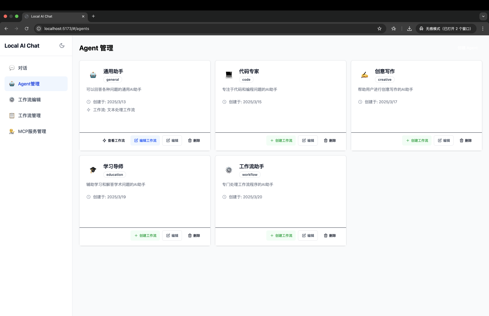

# Local AI Chat

这是一个使用 [Vite](https://vitejs.dev/) + [React](https://react.dev/) + [TypeScript](https://www.typescriptlang.org/) 构建的项目，结合了 [Tailwind CSS](https://tailwindcss.com/) 和 [Radix UI](https://www.radix-ui.com/) 组件库。


## 功能特性

本项目是一个基于本地大语言模型的智能对话系统，提供以下核心功能：

### 智能聊天

- **多模型支持**：集成Ollama，支持多种本地大语言模型
- **流式响应**：实时流式显示AI回复，提供更自然的对话体验
- **会话管理**：创建、保存和管理多个聊天会话
- **文件上传**：支持上传文件与AI交互
- **聊天历史**：自动保存并组织聊天历史记录


### 智能代理（Agents）

- **自定义代理**：创建和配置具有特定角色和能力的AI代理
- **代理管理**：编辑、删除和组织多个智能代理
- **系统提示词**：为代理设置专属的系统提示词，定制AI行为和专业领域



### 工作流（Workflow）

- **可视化编辑器**：直观的工作流设计界面
- **任务自动化**：将复杂任务拆分为可自动化的工作流程
- **代理集成**：在工作流中集成和编排多个AI代理
- **自定义节点**：支持创建和配置自定义工作流节点


## 技术特性

- **本地部署**：完全在本地运行，保护数据隐私安全
- **低延迟**：本地模型处理，减少网络延迟
- **可扩展**：模块化设计，易于扩展新功能
- **轻量级**：优化的资源占用，适合个人电脑运行

## 前提条件

- 安装 [Ollama](https://ollama.ai/) 并运行本地模型
- 推荐安装以下模型:
  - Llama3.2:latest
  - deepseek-r1:8b
  - deepseek-r1:14b

## 使用场景

- 个人助理：日常问答、信息查询和任务辅助
- 内容创作：写作辅助、创意激发和内容改进
- 知识管理：整理笔记、归纳总结和知识提取
- 开发助手：代码生成、调试辅助和技术咨询
- 自动化流程：创建自定义工作流处理复杂任务

## 开始使用

首先，安装项目依赖：

```bash
npm install
```

然后，运行开发服务器：

```bash
npm run dev
```

在浏览器中打开 [http://localhost:5173](http://localhost:5173) 查看结果。


你可以通过修改 `src/App.tsx` 开始编辑页面。保存文件后，页面会自动更新。

## 项目结构

- `src/components` - 可复用的UI组件
- `src/pages` - 应用的页面组件
- `src/lib` - 工具函数和共享逻辑
- `src/store` - 状态管理
- `src/styles` - 全局样式和Tailwind配置
- `src/types` - TypeScript类型定义

## 构建生产版本

要构建生产版本，运行：

```bash
npm run build
```

预览生产构建：

```bash
npm run preview
```

## 学习更多

要了解更多关于Vite和React的信息，请查看以下资源：

- [Vite 官方文档](https://vitejs.dev/guide/) - 了解Vite的功能和API
- [React 文档](https://react.dev/) - 了解React
- [Tailwind CSS 文档](https://tailwindcss.com/docs) - 了解Tailwind CSS
- [Radix UI 文档](https://www.radix-ui.com/docs/primitives/overview/introduction) - 了解Radix UI组件
